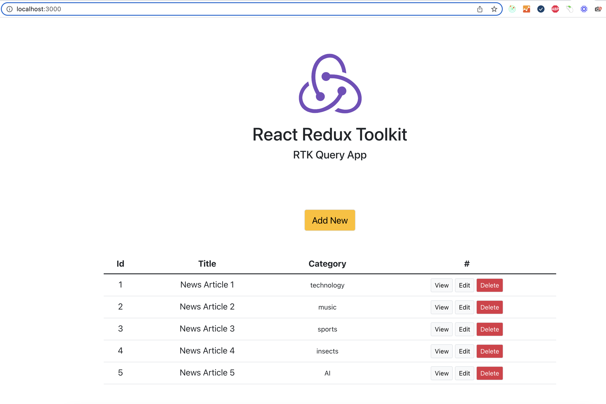

# React Redux Toolkit
## RTK Query App

## `Project Specifications`

- Create a simple CRUD using redux kit query.
- The graphics aren't important I'm interested in seeing how it fares with reactJs programming and your programming style.
- for data use json server: https://github.com/typicode/json-server
    
## `Solution Manual`
Start by running `npm install` 
To start the Json-Server run the command `json-server --watch db.json --port 4000`  
This fires up your json-server at  [http://localhost:4000](http://localhost:4000)

## `Screen Demo`
With all things been equal, you should have your application running like the image we are having below

